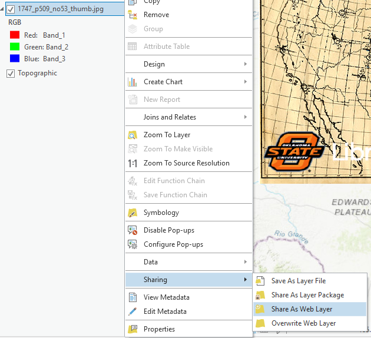
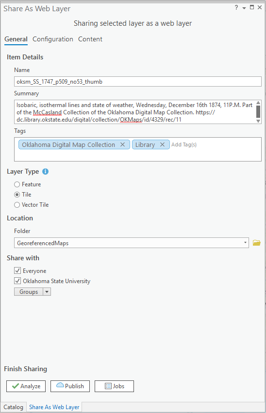
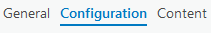
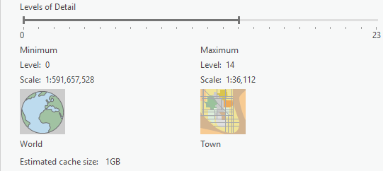
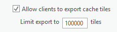
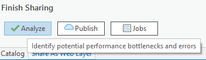
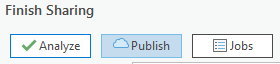

## About
Last Updated *[add date here]*   
Created by [OSU Maps and Spatial Data](https://info.library.okstate.edu/map-room)

## Table of Contents
- Introduction 
- *[Publishing a Georeferenced Map]*
- Conclusion
- Further Reading/Resources

## Introduction
ArcGIS Pro allows completed projects to be published online or shared with others. ArcGIS Online is a common publishing platform. For more information on how to georeference a map, go to (add link).

## *[Publishing a Georeferenced Map]*
1. Open a georeferenced map in ArcGIS Pro. Make sure it is highlighted/selected in the *Contents* pane.
2. Double check the georeferencing and add any additional points if necessary.

*Note: A minimum of four control points should be placed. **Spline** is the preferred transformation for accuracy and requires 10 or more control points, but there are other transformations when this number of control points is not possible. The more control points that are added, the more precise the transformation will be. Also, it is best to have the control points evenly distributed throughout the map to reduce the chances of transformation error.*

3. Right click the map layer in contents, then **Sharing** and **Share As Web Layer**.

4. Set the name to the file name, but prefix it with *oksm* plus the appropriate collection ID, replace spaces with underscores, and remove any file extension. 

*For example, 832 Map 2.jpg becomes oksm_SS_832_Map_2.*

5. Find the map in the [digital collection](https://library.okstate.edu/search-and-find/collections/digital-collections/oklahoma-digital-maps-collection/).  
6. For the *Summary*, include the year, title, which subcollection it belongs to and a link to the map in the digital collection.
7. For *Tags*, include **Oklahoma Digital Map Collection** and **Library**.
8. Set *Layer Type* to **Tile**.
9. Set the folder to **GeoreferencedMaps**. If needed, create a new folder using dropdown.
10. Check **Everyone** under *Share with*.

11. Now click **Configuration** at the top, next to *General*.

12. Set the *Levels of Detail*. 

*Note: For a map of Oklahoma, set the maximum to 17. For a map of the continental US, set the maximum to 12 )*

13. Check **Allow clients to export cache tiles**, and leave the value at the default of **100000**.

14. Now click the **Analyze** button.

*Note: If all is well, you should see a single warning, 20034 Your web layer will use the WGS 1984…
If you see any other warnings or errors, please see Kevin.*
15. If that’s the only warning you see, go ahead and click **Publish**. A pop up should appear, saying it has been successfully published. 

 

*Note: The process of publishing may take some time.*
16. Record your progress on the [spreadsheet](https://docs.google.com/spreadsheets/d/11AVFGlfQdQSNu6PRN98cSw4xKW1NvMasxrXGEZOBSko/edit?usp=sharing).

## Conclusion
ArcGIS Pro offers numerous options when it comes to sharing or publishing projects. 

## Further Reading/Resources

[Return to Top](#about)
